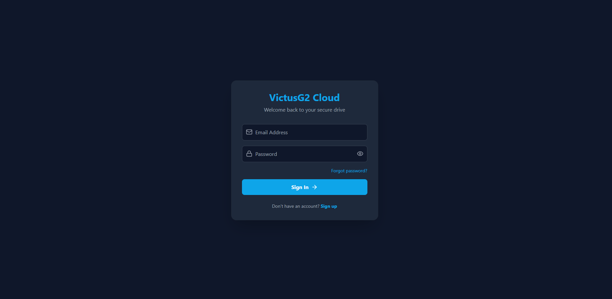
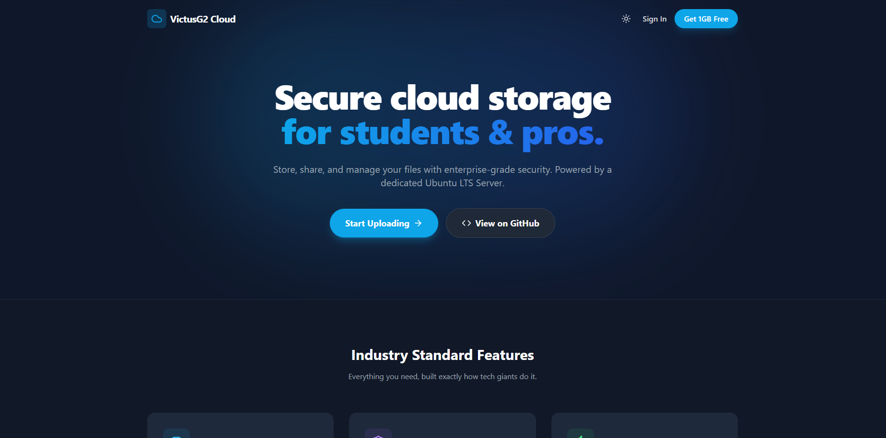
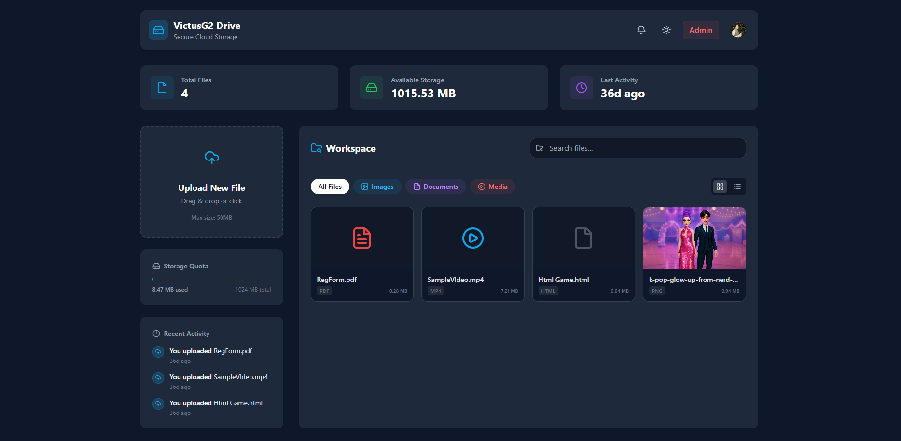
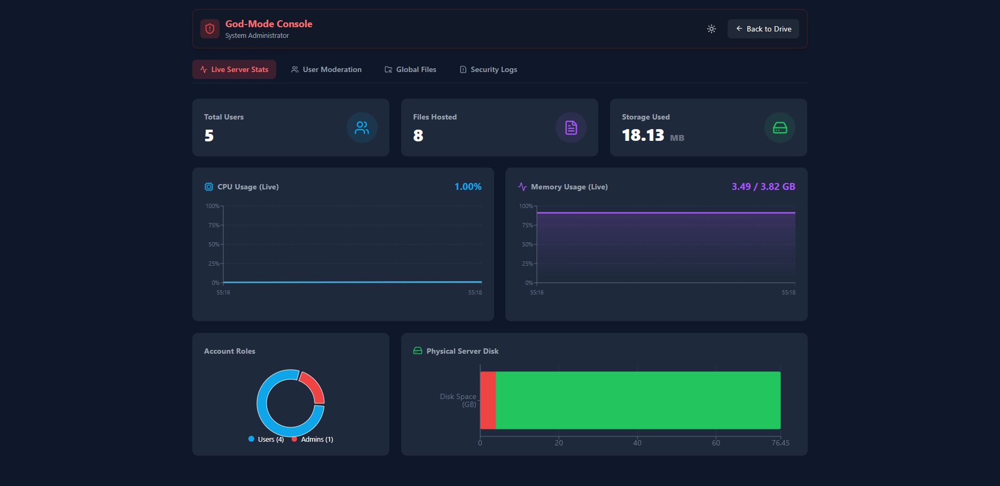

<p align="center">
  
</p>

<h1 align="center">☁️ VictusG2 Cloud Drive</h1>

<p align="center">
  <b>An Enterprise-Grade, Full-Stack Cloud Storage Platform with Persistent Server-Side Storage</b>
</p>

<p align="center">
  <a href="https://victusg2.me">
    
  </a>
  
  
  
  <a href="https://opensource.org/licenses/MIT">
    
  </a>
</p>

<p align="center">
  <i>Designed for reliability, persistence, and full infrastructure control — bridging academic theory with production-grade implementation.</i>
</p>

---

## 📖 Table of Contents
1. [System Architecture](#-system-architecture)
2. [Core Features](#-core-features)
3. [Technology Stack](#️-technology-stack)
4. [Project Structure](#-project-structure)
5. [Local Development Guide](#️-local-development-guide)
6. [API Reference](#-api-reference)
7. [Production Deployment (VPS/Ubuntu)](#-production-deployment-vpsubuntu)
8. [Team & Contributions](#-team--contributions)
9. [Roadmap (v2.0)](#️-roadmap-v20)
10. [License](#-license)

---

## 🚀 System Architecture

The architecture of VictusG2 represents a deliberate transition from **ephemeral, container-based hosting environments** (e.g., Heroku, Render) to a **stateful, self-managed VPS infrastructure**. This decision was driven by the need to achieve persistent storage without reliance on third-party object storage services such as AWS S3.

By deploying the system on a dedicated **Ubuntu 24.04 LTS virtual machine (DigitalOcean)**, the platform establishes a stable compute layer where application state and file storage are fully controlled.

### 🧠 Architectural Flow

```
Client (React Frontend)
        ↓
Node.js API (Express Backend)
        ↓
Supabase (Auth + PostgreSQL Metadata)
        ↓
Local Disk Storage (/var/www/uploads)
```

### 🔑 Key Architectural Decisions

**1. Persistent Storage Layer**
- Files are stored directly on the server filesystem at:
  ```
  /var/www/uploads
  ```
- Eliminates dependency on external storage APIs
- Ensures data persistence across deployments and reboots

**2. Hybrid Data Management Model**
- **Database (Supabase PostgreSQL)** → metadata, authentication, quotas
- **Filesystem** → binary file storage

**3. Logical Quota Enforcement**
- Storage limits enforced at the application layer
- Real-time validation before write operations
- Prevents uncontrolled disk consumption

**4. Infrastructure Control**
- Full control over OS-level configurations (Ubuntu kernel)
- Vertical scalability (CPU, RAM, disk)
- No cold starts or ephemeral resets

This architecture results in a **predictable, cost-efficient, and production-reliable system**, aligning with real-world cloud deployment practices.

---

## ✨ Core Features

### 🛡️ Security & Authentication
- Supabase Auth Integration for secure email/password authentication
- Stateless JWT session handling
- Row Level Security (RLS) enforcing strict per-user data isolation
- File validation middleware (Multer) blocking executable payloads (`.exe`, `.sh`, `.bat`, `.msi`)
- Nginx reverse proxy with SSL/TLS encryption via Let’s Encrypt

---

## 📸 Screenshots

### 🔐 Authentication (Login Page)
<p align="center">
  
</p>

---

### 📊 HomePage
<p align="center">
  
</p>

---

### 📂 File Upload System
<p align="center">
  
</p>

---

### 👑 Admin Console (System Telemetry & Controls)
<p align="center">
  
</p>

---

### 📂 Storage & Media System
- Persistent SSD-backed storage using direct filesystem writes
- Browser-native streaming of MP4 videos, PDFs, and images
- Drag-and-drop upload system using FormData APIs
- Smooth UI transitions powered by Framer Motion
- Real-time UI updates without full-page reloads

---

### 👑 God-Mode Admin Console
- Real-time system telemetry (CPU, RAM, disk usage) via `systeminformation`
- Role-Based Access Control (RBAC) using JWT claims
- Administrative capabilities:
  - Global file inspection
  - User promotion
  - Recursive file deletion for malicious accounts

---

## 🛠️ Technology Stack

| Domain | Technology Used |
| :--- | :--- |
| Frontend | React.js (Vite), Tailwind CSS, Framer Motion, React Dropzone, Lucide Icons |
| Backend API | Node.js, Express.js, Multer, Helmet.js, CORS |
| Database & Auth | Supabase (PostgreSQL), JWT, Custom SQL Triggers |
| Infrastructure | DigitalOcean Droplet (Ubuntu 24.04 LTS), Nginx, PM2, Certbot (SSL) |

---

## 📁 Project Structure

```bash
VictusG2-Documentation/
├── frontend/                  # React.js Client Application
│   ├── public/
│   ├── src/
│   │   ├── components/        # UI Components (Modals, Dropzones, Navigation)
│   │   ├── pages/             # Application Views (Dashboard, Admin, Login)
│   │   ├── context/           # Global State Management (Auth Context)
│   │   ├── utils/             # Helper Functions
│   │   └── App.jsx
│   ├── package.json
│   └── vite.config.js
│
├── backend/                   # Express.js API Server
│   ├── controllers/           # Business Logic (Auth, Files, Admin)
│   ├── middleware/            # JWT Validation, File Filtering, Security Layers
│   ├── routes/                # API Route Definitions
│   ├── server.js              # Entry Point
│   ├── package.json
│   └── uploads/               # Local File Storage (Git-Ignored)
│
└── README.md
```

---

## ⚙️ Local Development Guide

### 1. Prerequisites
- Node.js (v18 or higher)
- Git
- Supabase account

---

### 2. Database Configuration (Supabase)

```sql
CREATE TABLE profiles (
  id UUID REFERENCES auth.users NOT NULL PRIMARY KEY,
  email TEXT,
  role TEXT DEFAULT 'user',
  storage_used BIGINT DEFAULT 0
);
```

Enable Row Level Security (RLS) after table creation.

---

### 3. Environment Variables

```bash
git clone https://github.com/Amashing0411/VictusG2-Documentation.git
cd VictusG2-Documentation
```

**Frontend (`frontend/.env`)**
```env
VITE_SUPABASE_URL=https://your-project-ref.supabase.co
VITE_SUPABASE_ANON_KEY=your_supabase_anon_key
VITE_API_BASE_URL=http://localhost:5000/api
```

**Backend (`backend/.env`)**
```env
PORT=5000
SUPABASE_URL=https://your-project-ref.supabase.co
SUPABASE_SERVICE_KEY=your_supabase_service_role_key
UPLOAD_DIR=./uploads
```

---

### 4. Running the Application

```bash
# Backend
cd backend
npm install
mkdir uploads
npm start

# Frontend
cd frontend
npm install
npm run dev
```

Application runs at:
```
http://localhost:5173
```

---

## 📡 API Reference

### Authentication
| Method | Endpoint | Description |
|--------|--------|------------|
| POST | `/api/auth/login` | Authenticate user |
| POST | `/api/auth/register` | Register new user |

### File Management
| Method | Endpoint | Description |
|--------|--------|------------|
| POST | `/api/upload` | Upload file |
| GET | `/api/files` | Retrieve user files |
| DELETE | `/api/files/:id` | Delete file |

### Admin
| Method | Endpoint | Description |
|--------|--------|------------|
| GET | `/api/admin/stats` | System metrics |
| POST | `/api/admin/promote` | Promote user |

---

## 🌍 Production Deployment (VPS/Ubuntu)

### Server Setup
```bash
sudo apt update && sudo apt upgrade -y
sudo apt install nodejs npm git nginx -y
sudo npm install -g pm2
```

### Deployment
```bash
cd /var/www
git clone https://github.com/Amashing0411/VictusG2-Documentation.git victusg2

cd victusg2/frontend
npm install && npm run build

cd ../backend
npm install
pm2 start server.js --name victus-api
pm2 save
pm2 startup
```

### Nginx Configuration
```nginx
server {
    server_name victusg2.me www.victusg2.me;

    location / {
        root /var/www/victusg2/frontend/dist;
        index index.html;
        try_files $uri /index.html;
    }

    location /api/ {
        proxy_pass http://localhost:5000;
        proxy_set_header Host $host;
        proxy_set_header X-Real-IP $remote_addr;
        client_max_body_size 1024M;
    }
}
```

---

## 👨‍💻 Team & Contributions

Developed and maintained by **Group 2**.

| Team Member | Detailed Contributions |
| :--- | :--- |
| **Mark James Alcantara** | Lead System Architect and Full-Stack Developer responsible for designing the overall system architecture, implementing the React frontend, developing the Express.js backend API, configuring Multer-based file validation, integrating Supabase authentication and database logic, and deploying the application using Nginx, SSL (Certbot), and PM2. Also handled CI/CD considerations and infrastructure optimization. |
| **Alleny P. Hernandez** | Project Manager responsible for coordinating development timelines, managing cloud resource allocation, monitoring operational expenses, and securing GitHub Student Developer Pack benefits for infrastructure support. |
| **Myka Ella A. Dalit** | Infrastructure and Frontend contributor responsible for provisioning the Ubuntu virtual machine, configuring the Linux environment, assisting in deployment setup, and supporting frontend UI styling and responsiveness. |
| **Arwin E. Eser Jose** | Backend Developer responsible for implementing API routing, request handling, middleware integration, and debugging backend logic related to file validation and user operations. |
| **John Rei R. Tolentino** | Backend Developer responsible for Supabase database configuration, implementing logical quota enforcement mechanisms, and optimizing database queries and performance. |
| **Daniel Sotalbo** | Frontend Developer responsible for structuring React components, refining UI/UX interactions, and ensuring usability and responsiveness across different views. |
| **Brylle Edward A. Ramos** | Quality Assurance and Technical Support responsible for system testing, identifying bugs in production, validating security mechanisms, and assisting in deployment troubleshooting. |

---

## 🗺️ Roadmap (v2.0)

- TOTP-based Multi-Factor Authentication (MFA)
- Secure file sharing with expiring public links
- Nested directory system for hierarchical file organization

---

## 📜 License

This project is licensed under the [MIT License](https://opensource.org/licenses/MIT).

---

<p align="center">
  <b>VictusG2 Cloud — A practical implementation of full-stack cloud infrastructure engineering.</b>
</p>
